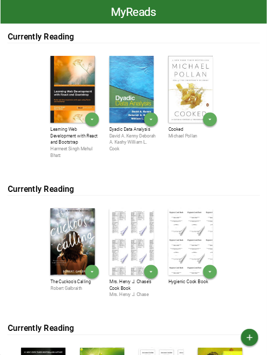
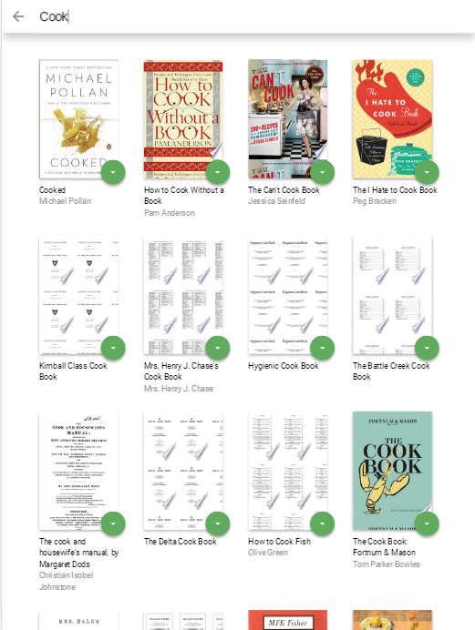
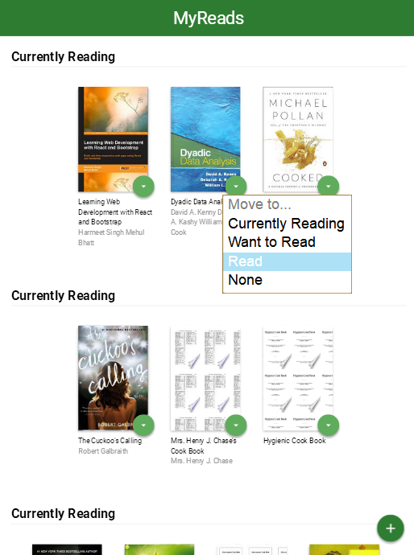

# React MyReads Project

## 使用React开发的 我的图书 WebApp

程序截图1--本地书架


程序截图2--搜索书架


**注意** 为了服务器性能考虑，搜索只支持以下搜索关键词

```
'Android', 'Art', 'Artificial Intelligence', 'Astronomy', 'Austen', 'Baseball', 'Basketball', 'Bhagat', 'Biography', 'Brief', 'Business', 'Camus', 'Cervantes', 'Christie', 'Classics', 'Comics', 'Cook', 'Cricket', 'Cycling', 'Desai', 'Design', 'Development', 'Digital Marketing', 'Drama', 'Drawing', 'Dumas', 'Education', 'Everything', 'Fantasy', 'Film', 'Finance', 'First', 'Fitness', 'Football', 'Future', 'Games', 'Gandhi', 'Homer', 'Horror', 'Hugo', 'Ibsen', 'Journey', 'Kafka', 'King', 'Lahiri', 'Larsson', 'Learn', 'Literary Fiction', 'Make', 'Manage', 'Marquez', 'Money', 'Mystery', 'Negotiate', 'Painting', 'Philosophy', 'Photography', 'Poetry', 'Production', 'Programming', 'React', 'Redux', 'River', 'Robotics', 'Rowling', 'Satire', 'Science Fiction', 'Shakespeare', 'Singh', 'Swimming', 'Tale', 'Thrun', 'Time', 'Tolstoy', 'Travel', 'Ultimate', 'Virtual Reality', 'Web Development', 'iOS'
```

程序截图3--给书本更改书架


## 部署方式

首先安装 Nodejs

然后在本项目的根目录下运行 `npm install` 会自动根据 packages.json 的内容下载构建组建。

最后，运行 `npm start` 建立本地服务器，自动打开网页，即可开始使用。